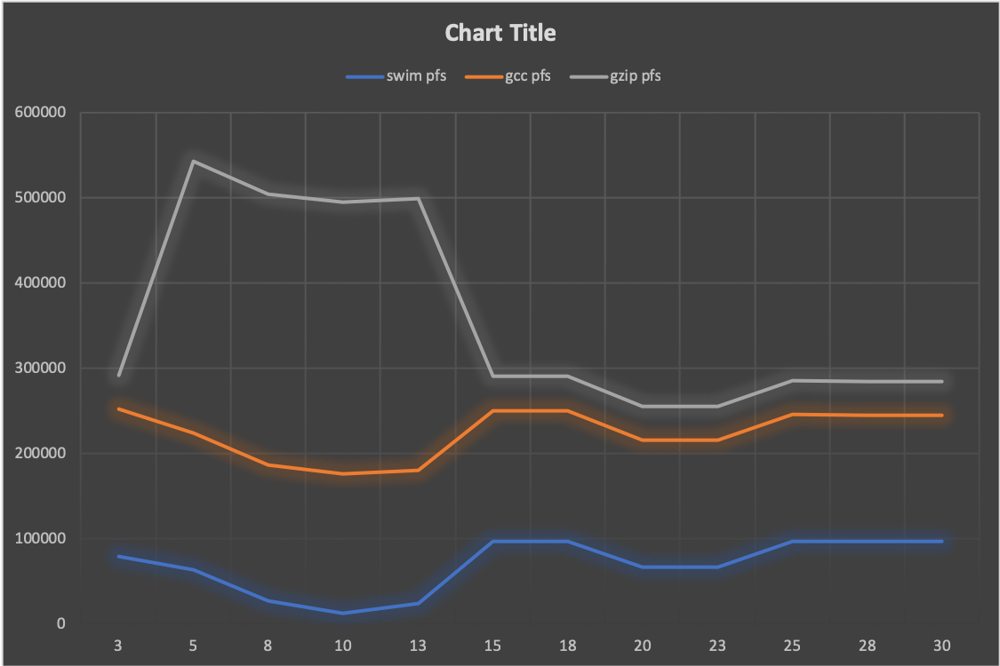

*jem319\n*
*CS1550*
# Project 3 Analysis

## Aging and Refresh

Picking a good refresh rate left me with a few options. The dips in page faults
left occurred in 2 places fairly consistently, with varying degrees of effectiveness.

1. `-r 10` is the more significant dip for 2/3 of the trace files. gzip.trace had a much less
significant change.
1. `-r 20` is the other solid choice. All 3 trace files dip here with one extreme change
with gzip.trace. As the aging algorithm is not always about optimizing, I think it is best
to go with this option as the average number of page faults is much lower than the rest.

## Frames and Page Faults

## Fifo and Belady's Anomaly
